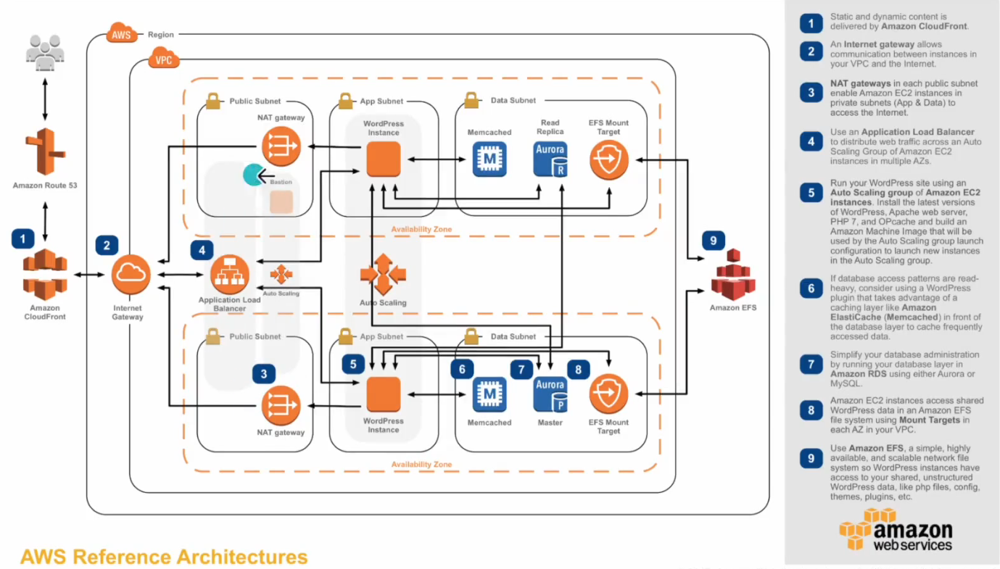
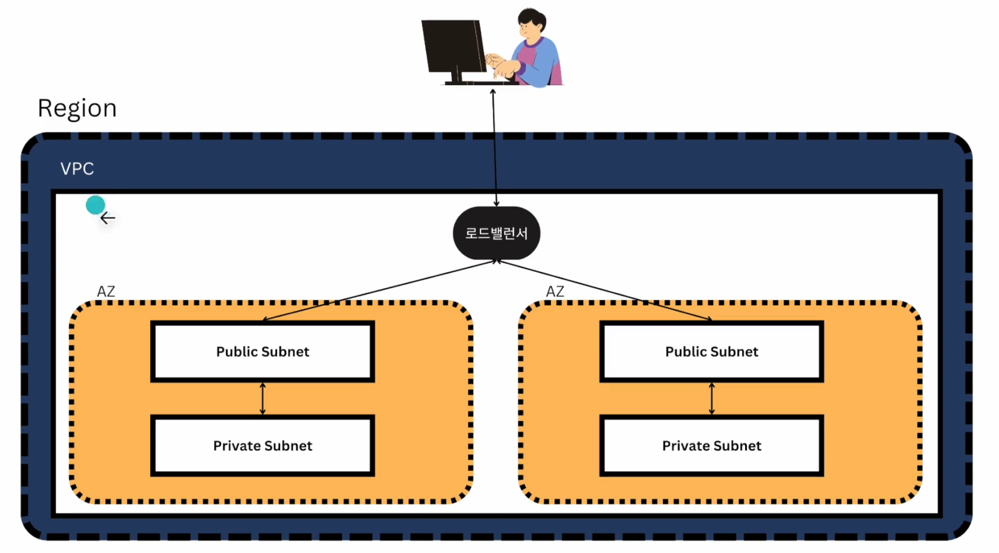
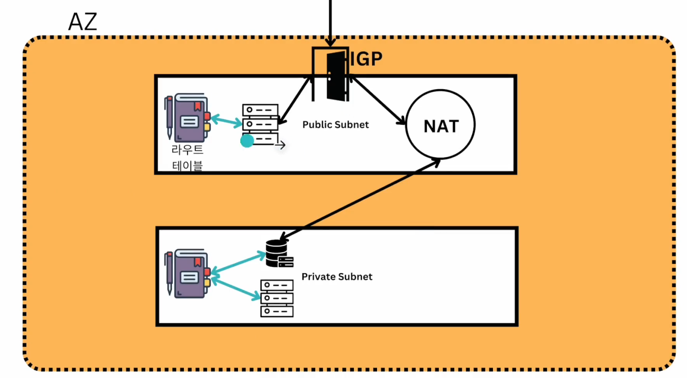

# Virtual Private Cloud
- 가상 사설 클라우드
- subnet :  같은 네트워크 인지 아닌지 구분해준다. 그 기준은 서브넷 마스크를 따른다.

### 아키턱처 구조 (3-tier Architecture)

### 구조

#### AZ 구조
- 퍼블릭 서브넷에 요청이 오면 인터넷 게이트 웨이를 통해 받는다.
- 각 서브넷 안에는 라우터 테이블이라는 하는 각 서비스를 이어주는 주소록과 같은 역할을 지닌 기능이 있다.
